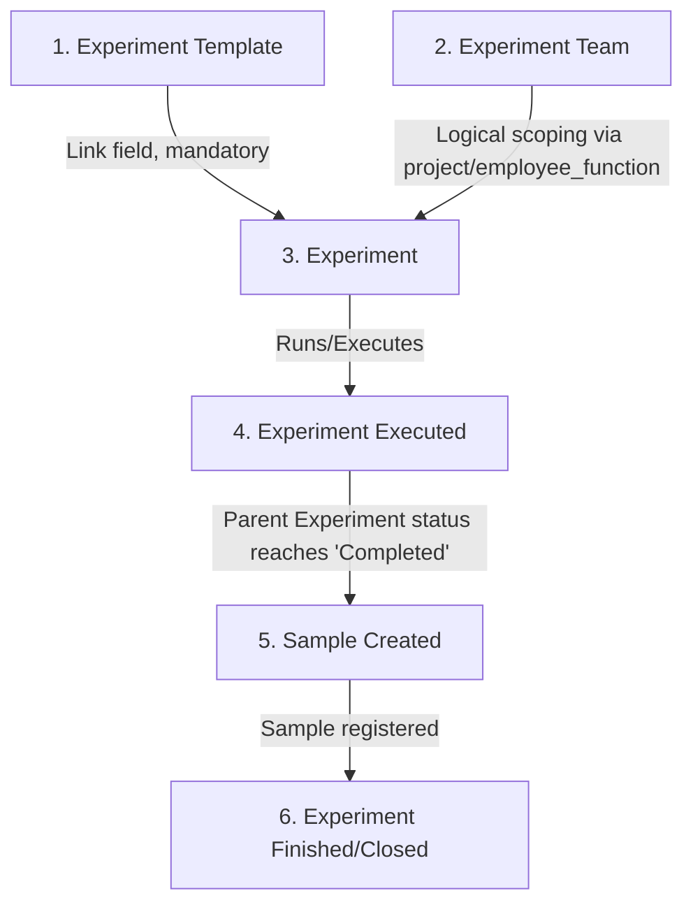

# Elab Notebook

An enterprise-grade laboratory experiment management platform for planning, executing, tracking, and analyzing experiments — built on top of the [Frappe Framework](https://github.com/frappe/frappe).

---

## 🚀 What Has Been Built So Far

We have developed both the Frappe-based backend infrastructure and a high-performance Vue 3 client interface. Here is a summary of the implemented features:

### 1. Backend Architecture (`elab_notebook`)
- **Dynamic DB Setup ([user.py](file:///wsl.localhost/Ubuntu/home/shivam/frappe-bench/frappe-bench/apps/elab_notebook/elab_notebook/elab_notebook/api/user.py)):** Includes a programmatic schema initializer (`setup_db()`) that automatically registers:
  - Custom child DocTypes: `Template Ingredient`, `Template Parameter`, and `Template Protocol Step`.
  - Extensions to the core `Experiment Template` DocType (e.g., adding `template_name`, `category`, `version`, `status`, `objective_hypothesis`, and ingredient/parameter/step tables).
  - Extensions to the core `Experiment` DocType (e.g., linking it to a template and injecting template child tables).
- **Authentication & User Management:** Custom session APIs to fetch user profile cards, initials, and designation values (`get_current_user_profile()`), along with development-redirect hooks (`login_redirect()`).
- **Template APIs ([template.py](file:///wsl.localhost/Ubuntu/home/shivam/frappe-bench/frappe-bench/apps/elab_notebook/elab_notebook/elab_notebook/api/template.py)):** Endpoints to query, save, retrieve detail, and instantiate new draft `Experiment` records directly from template models.
- **Analytics APIs ([dashboard.py](file:///wsl.localhost/Ubuntu/home/shivam/frappe-bench/frappe-bench/apps/elab_notebook/elab_notebook/elab_notebook/api/dashboard.py)):** Standard whitelist endpoints exposing lab summary numbers, monthly throughput trends, success rate distributions, chemical volume metrics, active logs, and pending tasks.

### 2. Frontend Interface (`elab-notebook-ui`)
A beautifully styled, high-performance web app built using **Vue 3, Vite, Pinia, and Chart.js**. Key features include:
- **Local Dev Proxy & Router Auth:** The app checks session state and coordinates login redirections smoothly between the Vite dev server (port `5173`) and the local Frappe bench (port `8000`).
- **Shell Layout ([ShellLayout.vue](file:///wsl.localhost/Ubuntu/home/shivam/frappe-bench/frappe-bench/apps/elab_notebook/elab-notebook-ui/src/components/layout/ShellLayout.vue)):** A custom layout featuring a side navigation bar, active breadcrumbs, user status cards, and responsive page routing.
- **Interactive Dashboard ([Dashboard.vue](file:///wsl.localhost/Ubuntu/home/shivam/frappe-bench/frappe-bench/apps/elab_notebook/elab-notebook-ui/src/components/dashboard/Dashboard.vue)):** Visualizes lab analytics, instrument metrics, monthly experiment completion trends (via Chart.js), chemical inventories, and active logs.
- **Templates Catalog ([TemplatesList.vue](file:///wsl.localhost/Ubuntu/home/shivam/frappe-bench/frappe-bench/apps/elab_notebook/elab-notebook-ui/src/components/templates/TemplatesList.vue)):** A filterable grid display of existing experiment protocols with usage counters and a new template creator modal.
- **Template Workspaces ([TemplateDetail.vue](file:///wsl.localhost/Ubuntu/home/shivam/frappe-bench/frappe-bench/apps/elab_notebook/elab-notebook-ui/src/components/templates/TemplateDetail.vue)):** An editor showing exact formulation specs (chemical grade/concentration), instrument settings (target, min, max parameters), and step-by-step checklists.

---

## 🛠️ Installation & Setup

### 1. Install Backend App
You can install this app using the [bench](https://github.com/frappe/bench) CLI:

```bash
cd $PATH_TO_YOUR_BENCH
bench get-app $URL_OF_THIS_REPO --branch develop
bench install-app elab_notebook
```

### 2. Bootstrap Database Schema
Run the database setup script via bench console or call the API endpoint once to ensure all child DocTypes and field customisations are created:

```python
# In bench console:
frappe.init(site="your-site-name")
frappe.connect()
from elab_notebook.elab_notebook.api.user import setup_db
setup_db()
```

### 3. Run Frontend Dev Server
Navigate to the UI folder, install node dependencies, and boot Vite:

```bash
cd apps/elab_notebook/elab-notebook-ui
npm install
npm run dev
```

The application is pre-configured to proxy `/api` requests to a local Frappe site running on `http://localhost:8000`.

---

## 🧪 Contributing

This app uses `pre-commit` for code formatting and linting. Please [install pre-commit](https://pre-commit.com/#installation) and enable it for this repository:

```bash
cd apps/elab_notebook
pre-commit install
```

Pre-commit is configured to use the following tools:
- `ruff` (Python linting & formatting)
- `eslint` (JS/Vue linting)
- `prettier` (Code style & markup formatting)
- `pyupgrade` (Python syntax modernization)

---

## 📦 CI/CD Workflows

The repository has two configured GitHub Actions workflows:
- **CI:** Installs the app dependencies and runs test files on push to `develop`.
- **Linters:** Executes Semgrep checks and `pip-audit` to detect security vulnerabilities on pull requests.

---

## 🔄 Function-Scoped Project Selector & Dual Dashboard Mode

We have implemented a role-based, function-scoped project access control mechanism and a dual-mode filtering system on the laboratory dashboard:

### 1. Function-Scoped Access Control (Backend & Frontend)
- **Whitelisted API (`get_employee_scope`):** Checks the user session, identifies the corresponding `Employee` record, and parses their active functions (from `custom_function_code` child table).
- **Scope Categorization & Priority:** 
  - **Function Scope (Highest Priority):** If the user is mapped to an active `Employee` record with active functions, they are strictly restricted to projects defined in the `project_list` child table of their linked `Employee Function` documents, even if they possess Administrator/System Manager roles.
  - **All Projects Fallback:** If they have no mapped active functions but carry the Administrator or System Manager roles, they bypass restriction and get access to all projects in the system.
  - **None:** If they are a regular employee with zero active functions, they are flagged as "No Function Assigned" and cannot access any projects.
- **Frontend Integration & Layout controls:** 
  - The top bar selector in [ShellLayout.vue](file://wsl.localhost/Ubuntu/home/shivam/frappe-bench/frappe-bench/apps/elab_notebook/elab-notebook-ui/src/components/layout/ShellLayout.vue) dynamically populates allowed projects in the dropdown menu.
  - If a user has no active functions assigned, the dropdown is disabled, showing a `"No function assigned"` warning state.
  - Added a **Sidebar Toggle Button** in the top bar that collapses the sidebar smoothly using CSS transitions.
  - Optimized dashboard layout rules in [Dashboard.css](file://wsl.localhost/Ubuntu/home/shivam/frappe-bench/frappe-bench/apps/elab_notebook/elab-notebook-ui/src/components/dashboard/Dashboard.css) to support responsive scaling, wrapping metrics widgets, stacking sections vertically on narrower viewports, and eliminating horizontal side-by-side scrolls.

### 2. Dual-Mode Dashboard Aggregation
- Every metrics widget (Summary Cards, Chemical Consumption, Run Volume trends, Success rates, yield trends, recent experiments, feeds, and tasks) accepts a `project` parameter.
- **Mode 'All Projects' (Aggregation):** If `All Projects` is selected, the dashboard aggregates metrics and averages trends specifically across the employee's subset of allowed projects (instead of blindly querying every project in the system).
- **Mode Specific Project (Filtering):** If a single project is selected, all dashboard components are filtered exclusively to that project's database entries and deterministic trends.

---

## 🧬 Experiment Template — Rebuilt as Versioned Code

The `Experiment Template` DocType and its child tables were rebuilt from scratch and **converted from UI-created custom DocTypes (`custom=1`, DB-only) into version-controlled code** under `elab_notebook/elab_notebook/doctype/`. They now belong to the **`Elab Notebook`** module (previously `Stock`).

### 1. Pre-flight findings (verified against the live site)

Two structural facts drove the implementation and are worth recording, because both differ from the naive assumption:

| Question | Answer found in DB |
|---|---|
| Employee Function head field | **No `head_name` field exists.** The doctype has `function_head` (Link → **User**) and `function_head_name` (Data, `fetch_from: function_head.full_name`). |
| Employee Function ↔ Project link | **Not a direct Link — two child tables, in both directions.** |
| Project ID source | **`Project` has no `project_id` field.** The template's `project_id` mirrors `Project.name`, so `fetch_from: project.name` is used. |

The EF ↔ Project relationship is stored on **both** sides, and neither table is complete on its own:

- **A.** `Employee Function.project_list` → child `Project list`, whose `projects` field is **Data (not a Link)** holding the Project name, e.g. `PLTP-2025-0041`. Covers 96 / 109 Employee Functions.
- **B.** `Project.custom_function_info` → child `Employee Function Child`, whose `function_code` is a Link to Employee Function. Covers 89 / 167 Projects.

Because neither is authoritative alone, the resolver **unions both paths**.

### 2. Child DocTypes (`istable = 1`)

| DocType | Fields |
|---|---|
| `Experiment Step CT` | `step_no` (Int), `instruction` (Small Text), `expected_duration` (Duration), `is_critical` (Check) |
| `Observations CT` | `parameter` (Data), `observed_value` (Data), `remarks` (Small Text), `observed_on` (Datetime) |
| `Material Required CT` | `item_code` (Link → Item, reqd), `item_name` (Data, fetch `item_code.item_name`, read-only), `uom` (Link → UOM, fetch `item_code.stock_uom`), `qty` (Float, reqd) |
| `Equipment Details CT` | `refer_to_experiment` (**Data**), `equipment_name` (Data), `equipment_id` (Data), `remarks` (Small Text) |
| `Methodology CT` | `method` (Small Text, reqd), `time_to_complete` (**Int** — *Time to Complete (Minutes)*) |

> `Equipment Details CT.refer_to_experiment` is **Data, not a Link**. The reference is a free-text note the user types — it is deliberately not tied to the `Experiment` DocType, because the experiment being referred to often does not exist as a record yet when the template is written.
>
> `Experiment Step CT` is listed for completeness but is **no longer used by `Experiment Template`** — see [§ Protocol table removed](#3-protocol-table-removed).

### 3. `Experiment Template` DocType

Doctype-level settings: `is_submittable = 1`, `autoname = format:ET-{project_id}-{######}`, `module = Elab Notebook`, `sort_field = modified`, `sort_order = DESC`, `title_field = title`, `track_changes = 1`.

Field sequence (42 fields, in order):

1. `title` (Data, **reqd**) · 2. `type` (Select: R&D-Early Stage / R&D-Analytical / Validation / Scale-Up / Process Development) · 3. `description` (Small Text) · 4. `disable` (Check, default 0)
5. `employee_function` (Link → Employee Function, **reqd**, standard filter) · 6. `head_name` (Data, `fetch_from: employee_function.function_head_name`, read-only)
7. *Column Break* · 8. `allowed_roles` (Link → Department, label **Department**) · 9. `project` (Link → Project, **reqd**, standard filter) · 10. `project_id` (Data, `fetch_from: project.name`, read-only) · 11. `remark` (Small Text)
12. *Section Break* · 13. `aim` (Data) · 14. `sub_aim` (Small Text) · 15. *Column Break* · 16. `rationale` (Long Text)
17. *Section: Material Required* · 18. `material_required` (Table → Material Required CT)
19. *Section: Equipment Details* · 20. `equipment_details` (Table → Equipment Details CT)
21. *Section: Methodology* · 22. `methodology` (Table → Methodology CT) · 23. `total_duration` (Int, read-only, no_copy, non_negative — server-computed) · 24. `methodology_comments` (Text Editor, standalone)
25. *Section: Protocol* · 26. `steps` (Text Editor)
27. *Section: Observation* · 28. `observation_table` (Table → Observations CT) · 29. `observation_comments` (Text Editor)
30. *Section Break* · 31. `amended_from` (Link → Experiment Template, read-only, no_copy, print_hide)
32. *Section: Legacy Template Fields* (collapsible) · 33–42. `template_name`, `category`, `version`, `status`, `objective_hypothesis`, `created_by`, `department`, `template_ingredients`, `template_parameters`, `template_protocol_steps`

> The legacy fields (33–42) are **retained deliberately** — [template.py](elab_notebook/elab_notebook/api/template.py) reads them. Removing them would break the template APIs and the Vue templates catalog.

**Permissions:** `System Manager` — full (read/write/create/delete/submit/cancel/amend/report/export/print/email/share). `Employee` — read/write/create/submit/amend with `if_owner = 1` and `delete = 0`.

### 4. Naming fix — `before_naming`

`autoname` depends on `project_id`, but Frappe runs `set_new_name()` **before** `fetch_from` is applied. Pre-existing records show the resulting bug (`ET--022223`, with a null `project_id`). [experiment_template.py](elab_notebook/elab_notebook/elab_notebook/doctype/experiment_template/experiment_template.py) resolves `project_id` in `before_naming()` so names come out correctly as `ET-PLTP-2025-0041-022229`.

`validate()` additionally rejects an `employee_function` that is not mapped to the selected `project` — server-side enforcement, so the client filter cannot be bypassed via API.

### 5. Employee Function filtering

[api/employee_function.py](elab_notebook/elab_notebook/api/employee_function.py) exposes:
- `get_employee_functions_for_project(project)` — unions link paths **A** and **B**.
- `employee_function_query(...)` — a `@frappe.validate_and_sanitize_search_inputs` link-field query used by `frm.set_query`.
- `get_project_employee_functions(project)` — plain whitelisted helper for the Vue UI.

[experiment_template.js](elab_notebook/elab_notebook/elab_notebook/doctype/experiment_template/experiment_template.js) wires the query in `setup`, and on `project` change clears `employee_function`, `head_name`, and re-seeds `project_id` so a stale EF from a previous project cannot survive.

### 6. Owner-based access isolation (critical)

`Employee Function` is a **shared master** — many employees sit under the same function — so field-level scoping cannot isolate one employee's templates from a colleague's. Isolation is therefore **owner-based and enforced on the server**, in [permissions.py](elab_notebook/permissions.py), registered in [hooks.py](elab_notebook/hooks.py):

```python
permission_query_conditions = {
    "Experiment Template": "elab_notebook.permissions.get_permission_query_conditions",
}
has_permission = {
    "Experiment Template": "elab_notebook.permissions.has_permission",
}
```

- `get_permission_query_conditions` appends `` `tabExperiment Template`.`owner` = <user> `` to list/report queries.
- `has_permission` applies the same owner check to single-document access, so opening another user's record **by direct URL** is blocked too.
- `System Manager` and `Administrator` bypass both.

**Verified with two real users sharing one Employee Function (`VP-LTP-POC-008`):**

| Check | Result |
|---|---|
| List as user A | only A's own record |
| List as user B | only B's own record |
| B opens A's doc by URL | `PermissionError` (blocked) |
| A opens A's own doc | allowed |
| List as Administrator | both records (bypass) |

Also verified: autoname → `ET-PLTP-2025-0041-022229`; `head_name` auto-fetch → `Hitendra Jadhav`; submit → `docstatus = 1`; an Employee Function not mapped to the project is rejected on insert.

### 7. Migration notes & follow-ups

- The previous UI-built `Experiment Template` (14 records), `Experiment Step CT` (40 rows) and `Observations CT` (18 rows) were **dropped and recreated** from code. A SQL dump was taken before the drop.
- ⚠️ `Experiment Step CT` and `Observations CT` are **shared with the `Experiment` DocType** (`protocol_steps`, `observation_table`). Their rows under `Experiment` parents (6 and 5) were dropped along with the rebuild, and those two CTs now carry the new field set on the `Experiment` form as well.
- ⚠️ One `Experiment` record still links to a deleted template via `experiment_template` — a dangling link to clean up.
- ⚠️ A child DocType named **`Equipment Details`** already exists with effectively the same fields as the new `Equipment Details CT` (plus `equipment_status` and `qualification`). `Experiment.equipment_details` still points at the old one. Worth consolidating.
- ⚠️ `workflow_state` is **not** declared in the DocType JSON. The active Workflow **`Template flow`** owns it as an auto-generated Custom Field (standard Frappe behaviour); declaring it in both places raises *"A field with the name workflow_state already exists"* during migrate.
- ⚠️ `Template flow`'s states are `Draft → Pending from Reviewer → Pending Approval Of HOD → Rejected → Approved By HOD` and it grants transitions to a **`Reviewer`** role — tied to the removed `reviewer` field. This does **not** match the proposed `Draft → Planned → Ready → In Progress → Completed → Under Review → Approved → Closed` flow. Rebuilding it needs role/transition decisions and was left untouched.

#### 🔴 OPEN — Experiment Template approval inbox queries phantom workflow states

Deferred out of the `Lab Experiment` rebuild; **not fixed**, logged here so it is not lost.

[api/dashboard.py](elab_notebook/elab_notebook/api/dashboard.py) lines **334, 357, 359** filter pending `Experiment Template` records on `"Pending from System Manager"` and `"Pending For Approval"`. Neither state exists in `Template flow`, whose real states are `Draft → Pending from Reviewer → Pending Approval Of HOD → Rejected → Approved By HOD` (see the bullet above). The template approval inbox therefore **matches nothing and has never surfaced a pending template**.

This is the same bug class already fixed on the experiment side, where the inbox gated on the same two phantom strings while the live workflow emitted `Pending Approval from System Manager`. The fix is the same shape — align the filters to the states the workflow actually emits — but it belongs to the `Template flow` rebuild, since that workflow's states are themselves under review and a `Reviewer` role no longer backed by a field is involved. Fixing the filters against today's `Template flow` states would only have to be redone when that flow is rebuilt.

#### 🔴 OPEN — three migrated `Lab Experiment` records carry dangling template links

Pre-existing on the legacy records and **faithfully preserved** by the data copy, rather than silently nulled. Not fixed; logged here for a separate cleanup pass.

| Record | Dangling field(s) | Missing `Experiment Template` |
|---|---|---|
| `ELN-PLTP-2025-0017-000002-000001` | `template` | `ET-PLTP-2025-0065-020962` |
| `ELN-PLTP-2025-0017-000002-000002` | `template` | `ET-PLTP-2025-0024-021784` |
| `ELN-MCPL/LTP/DL/0009-000002-A0001` | `template`, `experiment_template` | `ET--022223` |

`ET--022223` is the mis-named template from the original `Experiment Template` rebuild (`autoname` ran before `fetch_from` populated `project_id` — see [§ 4 Naming fix](#4-naming-fix--before_naming)); the record it points at no longer exists.

The rows were inserted with direct SQL, which does not run link validation, so the copy itself succeeded. **The cost is deferred, not avoided:** opening any of these three in the Desk UI and saving raises `LinkValidationError`, because `validate_links()` runs on save. Cleanup means either pointing each at a real template or clearing the field.

---

---

## 🧭 Function-First Template Form & Minute-Based Timings

A second pass reworked how the Experiment Template form is driven, and fixed the styling defects that made the Vue form unusable.

### 1. Inverted dependency — Employee Function drives the form

Previously the form asked for a **Project** first and then scoped Employee Functions to it. That is backwards for how the lab actually works: every employee is mapped to an Employee Function, and each function owns a set of projects. The dependency is now:

```
signed-in User → Employee → active Employee Function → Projects → Department
```

- `employee_function` is resolved from the signed-in user via **`get_current_employee_function()`**, which walks `Employee.custom_function_code` (child doctype `Employee Function Child`, `active = 1`). When the user has exactly one active function it is **pre-selected**; when they have several they pick from their own list only.
- `head_name` auto-fills from `employee_function.function_head_name` — on selection *and* when loading an existing document, so the read-only field is never left blank.
- `project` is scoped by **`get_employee_function_project_options()`** / **`project_query()`**, the mirror of the earlier resolver: it unions `Employee Function.project_list` and `Project.custom_function_info`.
- Changing the Employee Function clears `project`, `project_id`, and the Department, so a stale project cannot survive the switch.
- `allowed_roles` (**Department**) auto-fills from `Project.department`, falling back to `Employee Function.department`. The project option already carries `department`, so no second round trip is needed, and `set_department_from_project()` repeats the fill server-side for API callers. It stays editable — an explicit choice is never overwritten.

  > The fallback is not cosmetic: only **11 of 167** Projects actually carry a department, whereas **all 109** Employee Functions do. Filling from the Project alone would have left the field blank about 93% of the time.
- The Department picker lists **enabled departments only** (`disabled = 0`), in both the Vue form and the desk form.

Server-side `validate_employee_function_project()` still enforces the pairing, so the client-side scoping cannot be bypassed through the REST API.

### 2. Time is minutes, everywhere

The three-part day/hour/minute Duration widget is gone. Every timing field is now a single whole-minute `Int`:

| Field | Before | After |
|---|---|---|
| `Methodology CT.time_to_complete` | Duration (seconds) | **Int** — *Time to Complete (Minutes)* |
| `Experiment Template.total_duration` | Duration (seconds) | **Int** — *Total Duration (Minutes)* |

`DurationInput.vue` was replaced by **`MinutesInput.vue`** (one number field with a `min` suffix), and `utils/duration.js` now exposes `toMinutes()` / `formatMinutes()` — display-only helpers, since no unit conversion happens on the wire any more. Both tables were empty at the time of the change, so no stored value was reinterpreted.

### 3. Protocol table removed

`protocol_steps` (Table → `Experiment Step CT`) was dropped from `Experiment Template`. The **Steps** rich-text field is kept as the free-form protocol write-up, so the Protocol section still exists — just without the grid.

> `Experiment Step CT` itself was **not** deleted: the `Experiment` DocType still uses it for its own `protocol_steps` table. Its `expected_duration` is therefore still a Duration field — converting it would have changed the Experiment form, which was out of scope here.

### 4. Styling and responsiveness

The root cause of the broken form: **`LinkField.vue` carries no styles of its own, and no stylesheet defined `.link-dropdown` / `.link-option`.** The browser fell back to a plain bulleted `<ul>` rendered in the document flow, with the name and description `<span>`s running together — which is why options read `MCPL/LTP/DL/0005Developing Next-generation…` and `Accounts - MCPLAccounts`.

Added to [TemplateDetail.css](elab-notebook-ui/src/components/templates/TemplateDetail.css):

- **Link dropdown** — absolutely positioned, elevated panel with shadow, scroll cap, highlight state, a two-line clamped description, and a positioned clear button.
- **MinutesInput** and **RichTextEditor** (toolbar, contenteditable surface, `:empty::before` placeholder) — both previously unstyled.
- **Tables** — `table-layout: fixed` with named column classes (`.col-link`, `.col-wide`, `.col-uom`, `.col-qty`, `.col-minutes`, `.col-datetime`) replacing inline `style="width:…"`, plus header fill, rounded corners, row hover, and no trailing border.
- **Responsive** — 3 → 2 → 1 column form grid at 1200px / 720px. Below **1024px** every table row restacks as a labelled card driven by `data-label` on each cell, with the delete button pinned to the corner.

`.table-scroll` deliberately uses `overflow: visible` rather than `overflow-x: auto` — a scroll container would clip the link dropdown opening out of a table cell. The card layout removes the need for horizontal scrolling instead.

---

## 👥 Experiment Team — Per-Project Participant Authorization

A new authorization layer between Employee Function and Experiment creation. Being in an Employee Function is **no longer sufficient** to create an Experiment: the function's head must first add you to the team for that specific project.

```
Employee Function head → picks a Project → names participants → those users may create Experiments
```

### 1. DocTypes

**`Experiment Team`** (`istable = 0`, autoname `format:ETEAM-{#####}`)

| Field | Type | Notes |
|---|---|---|
| `employee_function` | Link → Employee Function | `set_only_once`, pre-filled from the function you head |
| `head_name` | Data | `fetch_from employee_function.function_head_name`, read-only |
| `project` | Link → Project | `set_only_once`, scoped to the function's mapped projects |
| `project_id` | Data | `fetch_from project.project_name`, read-only |
| `participants` | Table → Experiment Team Participant | the roster |

**`Experiment Team Participant`** (`istable = 1`) — `user` (Link → User, mandatory), `full_name` (fetched, read-only), `employee` (Link → Employee, resolved on save).

### 2. Rules enforced in `validate()`

[experiment_team.py](elab_notebook/elab_notebook/doctype/experiment_team/experiment_team.py) rejects, in order:

- **Not the head** — `frappe.session.user` must equal `Employee Function.function_head`. A function with no head cannot have a team at all.
- **Unmapped project** — the Project must belong to the Employee Function (reuses the union resolver).
- **Duplicate pair** — one team per `(employee_function, project)`; the error names the existing record so you edit it instead.
- **Invalid participant** — every user must be an employee actively mapped to that Employee Function (`Employee.custom_function_code`, `active = 1`). Duplicates in the grid are rejected too.

> **Doctype permission is deliberately broad** (`All` role: read/write/create; delete restricted to System Manager). Only **70 of 92** function heads carry the `Employee` role, so gating on a role would have locked 22 heads out of their own teams. The head check in `validate()` is the real authorization, and visibility is scoped separately — see below.

### 3. Visibility — heads see only their own teams

Registered in [hooks.py](elab_notebook/hooks.py), implemented in [permissions.py](elab_notebook/permissions.py):

```python
permission_query_conditions = {
    "Experiment Team": "elab_notebook.permissions.get_team_permission_query_conditions",
}
has_permission = {
    "Experiment Team": "elab_notebook.permissions.has_team_permission",
}
```

Lists are filtered to `employee_function in (functions you head)`; a user who heads nothing gets `1 = 0`. The same check guards direct single-document access. System Manager / Administrator bypass both.

### 4. The gate on Experiment creation

`Experiment` is a UI-created doctype with no controller file, so the rule attaches through `doc_events` → [experiment_access.py](elab_notebook/experiment_access.py):

```python
doc_events = {"Experiment": {"before_insert": "elab_notebook.experiment_access.validate_experiment_participant"}}
```

**`before_insert` only.** Existing Experiments — and later edits to them — are deliberately untouched, so nobody is locked out of a record they already own. Creation is blocked when no team exists for the project, or when the user is not on it.

### 5. APIs

[api/experiment_team.py](elab_notebook/elab_notebook/api/experiment_team.py):

| Method | Purpose |
|---|---|
| `get_my_head_context()` | Which functions the signed-in user heads; `{is_head: false}` drives the no-access state |
| `get_function_projects()` | The function's projects, each flagged with whether a team already exists |
| `get_team()` | Existing roster **plus** the candidates that may be added |
| `save_team()` | Create-or-update, idempotent by `(function, project)` |
| `get_authorized_projects_for_user()` | Projects the user may actually create Experiments for — narrower than the EF→Project mapping |

[api/employee_function.py](elab_notebook/elab_notebook/api/employee_function.py) gained `get_employee_users_for_function()` (the roster resolver), plus `get_function_employees()` and `function_employee_query()` for the Vue and desk pickers.

### 6. Frontend — sidebar "Elab Notebook"

[TeamSetup.vue](elab-notebook-ui/src/components/team/TeamSetup.vue) at route `/elab-notebook`. Non-heads get a locked empty state rather than an error. Heads pick a function (auto-selected when they head only one), then a project — options are marked `✓ team set` where a roster already exists — then tick participants from a searchable, filterable roster with select-all / clear and a live selected count.

### 7. Verified

| Check | Result |
|---|---|
| Head loads own context | `is_head: true`, 1 function |
| Non-head loads context | `is_head: false` |
| Non-head reads another's team | `PermissionError` |
| Head saves roster | `ETEAM-…`, 1 participant |
| Outsider added as participant | rejected |
| Project not mapped to the function | rejected |
| Duplicate `(function, project)` | rejected |
| Participant creates Experiment | **created** |
| Non-participant creates Experiment | **blocked** |
| Participant, project with no team | **blocked** |
| Non-participant edits existing Experiment | allowed (by design) |
| Administrator | bypasses the gate |

### 8. Team list and detail view

**Heads are implicit participants.** The `before_insert` gate now passes on *either* condition — the user is listed in `participants`, **or** the user is the `function_head` of the team's Employee Function. A head never has to add themselves to their own roster. The rule lives in one place, `is_authorized_for_project()` in [experiment_access.py](elab_notebook/experiment_access.py), and both the server gate and the UI button state read from it, so they cannot drift apart.

**"Your Teams"** on `/elab-notebook` lists every team the head owns across all their projects — project, participant count (amber when zero), and last-updated — backed by `get_my_teams()`. Participant counts come from one grouped query rather than one per row. Empty state: *"No teams yet — pick a project above to set one up."*

**Detail view** at `/elab-notebook/<team-id>` ([TeamDetail.vue](elab-notebook-ui/src/components/team/TeamDetail.vue)) shows Employee Function, Head Name, Project ID and Project Name read-only, the participant roster as avatar rows, and an inline edit mode that reuses the **same `save_team()` endpoint** as creation — so every `validate()` rule (head check, project mapping, valid participants, no duplicates) applies to edits too.

**Create Experiment** opens the desk form pre-filled with `project` and `employee_function`, so the gate passes without the user selecting anything:

```
/app/experiment/new?project=<project>&employee_function=<function>
```

Because the Vite dev server only proxies `/api`, [frappeUrl.js](elab-notebook-ui/src/utils/frappeUrl.js) resolves the desk origin — `localhost:8000` in dev, same-origin in production.

Verified:

| Check | Result |
|---|---|
| `get_my_teams` as head / as outsider | 1 team / `[]` |
| Head opens detail, **not** on the roster | `can_create_experiment: true` |
| Participant opens detail | `PermissionError` (head-only) |
| Outsider opens detail | `PermissionError` |
| **Head creates Experiment, not on roster** | **created** (implicit) |
| Participant creates Experiment | created |
| Outsider creates Experiment | blocked |
| Authorized projects: head / participant / outsider | `[PROJ-0010]` / `[PROJ-0010]` / `[]` |

### 9. Participants can read their own team

The first cut made `has_team_permission` head-only, which blocked a legitimate participant from opening the very team that authorises them — a live blocker. Read access is now **head or participant**; write stays **head only**.

[permissions.py](elab_notebook/permissions.py):

- `PARTICIPANT_READ_PTYPES` — `read`, `print`, `email`, `share`, `select`, `report`, `export`. Anything outside that set (write, create, delete, submit) requires being the head. A `ptype` of `None` is treated as a read.
- `get_team_permission_query_conditions` now ORs two clauses — functions you head, plus teams you appear on — so the list view matches what the single-document check allows. Neither one? `1 = 0`.
- Enforcement is at the **hook** level, not just the API, so a participant calling `doc.save()` directly is refused too (verified).

**The "linked Employee record" cascade** came from `get_employee_users_for_function()` querying `Employee` as an ordinary user. That resolver only ever answers "who is in this function" and every caller is authorised before reaching it, so its two queries now run with `ignore_permissions=True`. Because that removes the implicit gate, the whitelisted entry points grew an explicit one — `can_see_function_roster()` allows the function head, anyone on a team under it, or a System Manager, and `get_function_employees()` / `function_employee_query()` both check it.

**Surface changes.** `get_team_detail()` returns `can_edit`, and withholds `candidates` entirely from non-editors. `get_my_teams()` returns headed *and* participating teams, each tagged `role: head | participant` — without this a participant had no route to the detail page. The setup page hides the Scope form for non-heads, shows "Your Teams" to everyone who has any, and reserves the locked state for users who are neither. The detail page swaps the Edit button for a read-only note naming the head.

| Actor | Read detail | Edit roster | Direct `doc.save()` | Roster API | Create Experiment |
|---|---|---|---|---|---|
| Head | ✓ | ✓ | ✓ | ✓ | ✓ (implicit) |
| Participant | ✓ | `PermissionError` | `PermissionError` | ✓ | ✓ |
| Outsider | `PermissionError` | — | — | `PermissionError` | blocked |

### 10. The real cause of "linked to Employee 36444"

Relaxing `has_team_permission` (§9) was necessary but **not sufficient**. A head was still blocked from opening their own team, and the reason was upstream of the hook entirely.

Reproduced against the live record `ETEAM-22244`:

| Fact | Value |
|---|---|
| `ETEAM-22244.employee_function` | `VP-LTP-ADL-001` |
| `VP-LTP-ADL-001.function_head` | `jayesh.desale@microcrispr.com` — exact User ID match |
| Team owner | `jayesh.desale@microcrispr.com` |
| Child rows link to Employee | `36444` (Chaitali), `36140` (Denna) |

So it was **his own team**, not a cross-function access attempt — the block was a genuine bug. `get_my_teams()` returned it correctly as `role: head`, yet `doc.check_permission("read")` raised `PermissionError`.

The cause: Jayesh carries a **User Permission** of `Employee = 36073` with `apply_to_all_doctypes = 1`. Frappe's `has_user_permission()` runs *before* any `has_permission` hook and rejects a document containing a link to any other Employee. The participant rows link to Employee `36444`, so the whole team document was refused — regardless of what the hook returned.

Fix: `ignore_user_permissions: 1` on `user` and `employee` in [Experiment Team Participant](elab_notebook/elab_notebook/doctype/experiment_team_participant/experiment_team_participant.json). A roster is by definition a list of *other* people, while most users are restricted to their own Employee record across all doctypes — the two are fundamentally incompatible, and the link fields must opt out.

> This is a **doctype meta** change, so it needs `bench migrate` **and** `bench --site <site> clear-cache`; the flag is cached in Redis and a stale cache reproduces the old error.

Verified after the fix — the failing operations now pass, and isolation is unchanged:

| Actor | Before | After |
|---|---|---|
| Jayesh (head) opens `ETEAM-22244` | `PermissionError` | **full detail returned** |
| Jayesh reads child rows (Employee 36444) | `PermissionError` | **both rows visible** |
| Jayesh re-saves the team | `PermissionError` | **saved** |
| Other head (`VP-COM-ERP-001`) | blocked | **still blocked** |
| Outsider | blocked | **still blocked**, `get_my_teams` = `[]` |
| Participant | read-only | **read-only**, edit still refused |

`ignore_user_permissions` disables only Frappe's *user-permission* layer on those two link fields. Role permissions, `permission_query_conditions`, and `has_team_permission` all still apply, so Employee-Function scoping is untouched.

### 11. Create Team dialog, and teams are no longer unique

**Uniqueness removed entirely.** The same Employee Function, Project *and* participant set may now produce any number of teams — each is a separate record distinguished only by its own ID. Gone:

- `set_only_once` on `employee_function` and `project`
- the `validate_unique_combination()` rule

The other three `validate()` rules are untouched: not-the-head, unmapped-project, and participants-must-be-active-members.

> **`save_team()` had to change, or the dialog would have silently overwritten data.** It used to be create-or-update keyed by `(function, project)` — the only sane behaviour while that pair was unique. With duplicates allowed, that lookup becomes ambiguous and would have edited whichever team was found first. It now takes an optional `team_name`: **with** it, that record is edited; **without** it, a new team is always created. The detail view passes `team_name`; the create dialog does not.

**UI.** The inline *Scope* form is gone, replaced by a **+ Create Team** button that opens a dialog: Employee Function and Head Name read-only and pre-filled, Project scoped to the function's mapped projects (each showing how many teams it already has), and a searchable member multi-select. Saving closes the dialog and refreshes the list immediately.

`get_create_context()` returns the functions, their projects and their rosters in one round trip, so the dialog opens without a waterfall of calls.

**Telling duplicates apart.** Since one project can now appear many times in "Your Teams", each row leads with its **team ID** (`ETEAM-…`) and a participant-name preview (`Chaitali, Denna +2`), alongside the existing role badge, count and timestamp. `get_my_teams()` returns `participant_names` for this, built from one query across all rosters rather than one per row.

Verified:

| Check | Result |
|---|---|
| Three saves, identical function + project + members | `ETEAM-22250 / 22251 / 22252`, all `created=true`, IDs distinct |
| Edit with `team_name` | edits that record only (`created=false`); sibling team unchanged |
| Unmapped project | `ValidationError` |
| Off-roster participant | `ValidationError` |
| Non-head, non-System-Manager creating | `PermissionError` |
| System Manager creating | allowed (documented bypass) |
| List rows | distinct IDs + differing name previews for same-project teams |

### 12. Follow-ups

- ⚠️ **17 Employee Functions have no `function_head`** (92 of 109 do). Those functions can never have a team, so nobody can create Experiments for their projects until a head is assigned.
- ⚠️ **The Experiment creation form's project dropdown is still unscoped.** `get_authorized_projects_for_user()` exists and is verified (and is now head-aware), but nothing calls it yet — the Experiment form is a desk form, not part of the Vue app. Pre-filling via the Create Experiment button covers the happy path; scoping the dropdown itself is a separate change.
- ✅ ~~The detail view is head-only.~~ Fixed — see §9. Participants now get a read-only view of their own team.
- ⚠️ **The "head not on the roster" disabled-button state is now unreachable.** Since heads are implicitly authorized and only heads can open the detail view, `can_create_experiment` is always true there. The disabled branch is kept as a defensive fallback only.
- ⚠️ `Experiment` already has an unrelated `participants` field (Table MultiSelect → `Participants CT`) for per-experiment attendees. Similar wording, different purpose — not to be confused with team membership.

## 📊 Unified Restructured Dashboard

We have completely restructured the main analytics dashboard into a unified, modular framework based on a single reusable component (`EntityStatsBlock`).

### 1. Reusable Entity Blocks (`EntityStatsBlock`)
Each primary database entity (Experiment Templates, Team, Experiments, and Instruments) uses the same 3-part layout:
- **Summary Cards (TOP)**: Grand total records count alongside status-wise count cards.
- **Month-Filtered Doughnut Chart (MIDDLE)**: A Chart.js doughnut chart depicting the breakdown of statuses for the selected month (or "All Time" aggregation), with a custom color-coded legend showing counts and percentages.
- **Grouped Month Table (BOTTOM)**: A dynamic table showing the monthly breakdown of status counts. Rows are sortable by month (chronological or reverse chronological) and clicking any row navigates directly to the filtered list view for that entity in Frappe Desk.

### 2. Supported Entities & DocTypes
- **Experiment Templates**: Built on the `Experiment Template` DocType, grouped by the `status` field.
- **Team**: Built on the `Employee` DocType, grouped by the `status` field.
- **Experiments**: Built on the `Experiment` DocType, grouped by the `workflow_state` field.
- **Instruments**: Built on the `Workstation` DocType, grouped by the `status` field.

### 3. Secure Backend API (`get_entity_stats`)
- **Whitelisted Endpoint**: Exposes stats under the `elab_notebook.api.dashboard.get_entity_stats` route.
- **Strict Validation**: The API validates that the input `doctype` exists in the system and that the requested `status_field` is defined on it to prevent injection vulnerabilities.
- **Project Filtering**: Standardizes scope filtering across all widgets. If the DocType has a `project` field, the API restricts statistics to the active project selection or allowed project scope.
- **Dynamic Status List**: Extracts status values directly from DocType Select metadata options or queries distinct values in the database, ensuring zero hardcoding.

---

## 🔄 Complete Lifecycle Flow

The lifecycle of the `elab_notebook` application represents a structured flow of planning, team organization, execution, and sampling.



### Complete Flow Steps:
1. **Experiment Template & Experiment Team**: Independent parent nodes (no relation to each other, both created first, standalone).
2. **Experiment**: Created by an Experiment Team member. Requires selecting an existing Experiment Template (Link field `template` and/or `experiment_template` - mandatory).
3. **Experiment executes/runs**: The experiment is executed and progress is recorded.
4. **Sample**: Created and linked to the parent Experiment only after the parent Experiment reaches "Completed" status (guarded server-side).
5. **Experiment Finished/Closed**: The final stage where samples have been collected, and the experiment is closed.

### 🛡️ Data Consistency & Referential Integrity

To enforce data consistency across all parent-child linked doctypes, parent documents cannot be deleted if any child document references it. We prevent cascade-deletes by blocking deletions with clear error messages via custom `on_trash` controller hooks and events:

1. **Experiment Template**:
   * **Guard**: `on_trash` controller hook in [experiment_template.py](file:///wsl.localhost/Ubuntu/home/shivam/frappe-bench/frappe-bench/apps/elab_notebook/elab_notebook/elab_notebook/doctype/experiment_template/experiment_template.py)
   * **Check**: Ensures no `Experiment` exists referencing this template name.
   * **Error**: `frappe.throw("Cannot delete: Experiment(s) exist using this Template.")`

2. **Experiment Team**:
   * **Guard**: `on_trash` controller hook in [experiment_team.py](file:///wsl.localhost/Ubuntu/home/shivam/frappe-bench/frappe-bench/apps/elab_notebook/elab_notebook/elab_notebook/doctype/experiment_team/experiment_team.py)
   * **Check**: Ensures no `Experiment` exists under the team's project and employee_function.
   * **Error**: `frappe.throw("Cannot delete: Experiment(s) exist under this Team.")`

3. **Experiment**:
   * **Guard**: `on_trash` event hook registered under `doc_events` in [hooks.py](file:///wsl.localhost/Ubuntu/home/shivam/frappe-bench/frappe-bench/apps/elab_notebook/elab_notebook/hooks.py) and handled in [experiment_access.py](file:///wsl.localhost/Ubuntu/home/shivam/frappe-bench/frappe-bench/apps/elab_notebook/elab_notebook/experiment_access.py)
   * **Check**: Ensures no `Sample` exists linking to this experiment name.
   * **Error**: `frappe.throw("Cannot delete: Sample record(s) exist for this Experiment.")`

---

## 📄 License
MIT License
